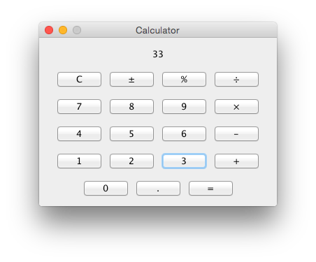

# protean-calculator

[](https://travis-ci.org/mes32/protean-calculator)

Calculator program with an extremely customizable graphical interface. Note, this is still a work in progress.



## Requirements

- [Gradle](https://gradle.org/)
- [Java 8](http://www.oracle.com/technetwork/java/javase/downloads/jdk8-downloads-2133151.html)

## Setup

```
# Clone this repository
git clone https://github.com/mes32/protean-calculator

# Build the jarfile using Gradle
cd protean-calculator
./gradlew jar

# Start the program with Java 8
java -jar build/libs/protean-calculator.jar
```

## Usage

```
# Launch the graphical calculator
$ java -jar build/libs/protean-calculator.jar

# Launch in roll your own mode to customize the graphical interface live
$ java -jar build/libs/protean-calculator.jar -ryo

# In commandline mode protean-calculator will evaluate an arithmetic expression
$ java -jar build/libs/protean-calculator.jar "(2 + 5) / 2"
3.5

# Alternatively a number of expressions can be piped in the program
$ echo -e "5 * 3\n 7\n 1 / 4" | java -jar build/libs/protean-calculator.jar
15
7
0.25
```

## License

The code in this repository is licensed under the [MIT License](./LICENSE).